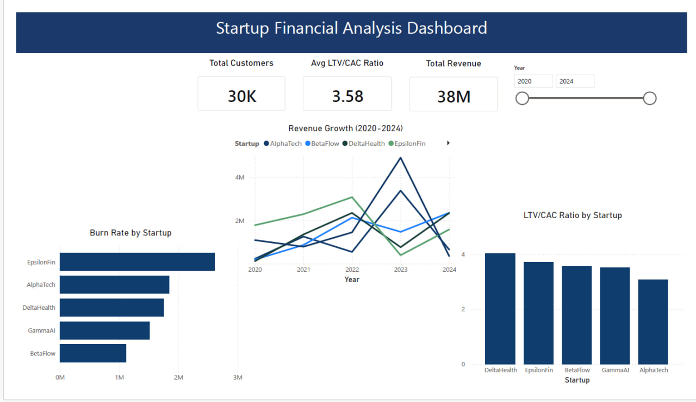

# Startup Financial Analysis | Python & Power BI

Analysis of financial performance for 5 startups (2020-2024) using Python and Power BI.

## 📊 Key Metrics
- **Total Revenue:** €38M across all startups
- **Avg LTV/CAC Ratio:** 3.58x (above healthy threshold of 3x)
- **Total Customers:** 30K+

## 🔍 Analysis Includes
- Revenue Growth trends (2020-2024)
- Burn Rate comparison by startup
- LTV/CAC Ratio analysis
- Interactive Power BI Dashboard
## 📸 Dashboard Preview

## 🛠 Tools Used
`Python` `Pandas` `Matplotlib` `Seaborn` `Power BI`

## 📁 Files
- `startup_financial_analysis.ipynb` — Python analysis
- `startup-financial-analysis.pbix` — Power BI dashboard
- `startup_financial_data.csv` — Dataset
- `startup_financial_analysis.pdf` — Dashboard export

## 👤 Author
[Hamidreza Asiyaeimoghadam](https://www.linkedin.com/in/hamidreza-asiyaeimoghadam-883316169)
